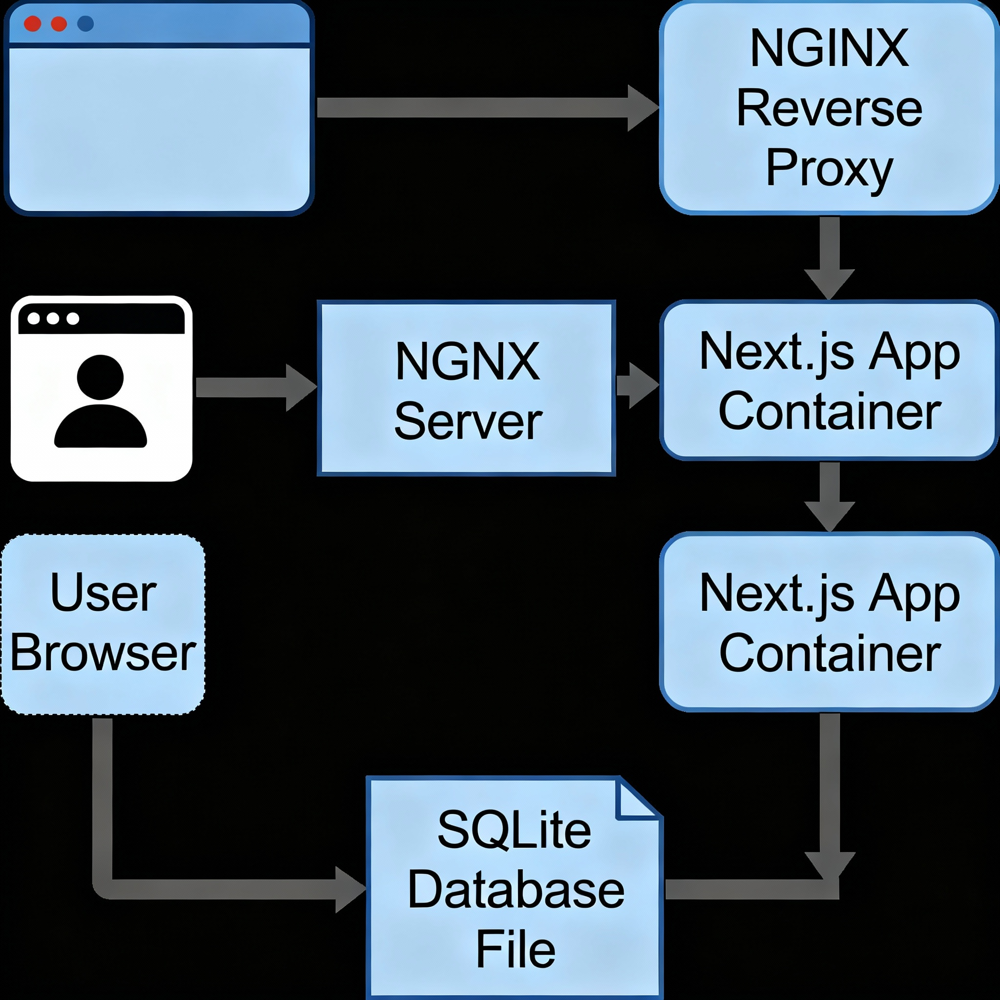

# Next.js-Expense-Tracker-Dockerized-with-Nginx-Reverse-Proxy
This project demonstrates how to containerize a Next.js application and use Nginx as a reverse proxy for efficient and secure production deployment.

## Overview

- **Frontend + Backend:** Built using Next.js (React with API routes).
- **Containerization:** Entire application is containerized using Docker for consistent deployment.
- **Reverse Proxy:** Nginx handles incoming HTTP(S) requests, serves static files, and forwards dynamic requests to the Next.js server running inside a Docker container.

## Architecture

- **Nginx** accepts all web traffic, serving static content directly for performance.
- **Nginx** forwards API and dynamic page requests to the Next.js server on port 3000.
- The app, Nginx, and SQLite DB (file-based) operate within the same Dockerized environment or as separate containers if needed.

## Features

- Production-grade Next.js setup.
- Secure, efficient traffic management with Nginx.
- Fully portable and reproducible deployment via Docker.

## Getting Started

### Prerequisites

- Docker installed on your system

### Build and Run

1. **Build Docker image:**
   docker build -t expense-tracker:latest .
2. **Run the container:**
   docker run -p 80:80 expense-tracker:latest
This exposes your app via Nginx on port 80.

### Nginx Configuration

- `nginx.conf` (or `default` site file) forwards all traffic to Next.js (except for static assets).

Example snippet:
location /_next/static/ {
alias /var/www/html/_next/static/;
expires 1y;
access_log off;
}

location / {
proxy_pass http://127.0.0.1:3000;
proxy_http_version 1.1;
proxy_set_header Upgrade $http_upgrade;
proxy_set_header Connection 'upgrade';
proxy_set_header Host $host;
proxy_cache_bypass $http_upgrade;
}

text

## Customization

- Add SSL/TLS for security.
- Swap SQLite for PostgreSQL/MySQL for larger-scale projects.
- Add a CI/CD pipeline for automation.

## License

MIT
